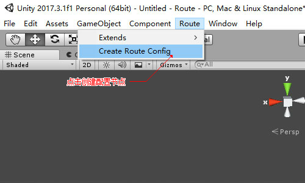
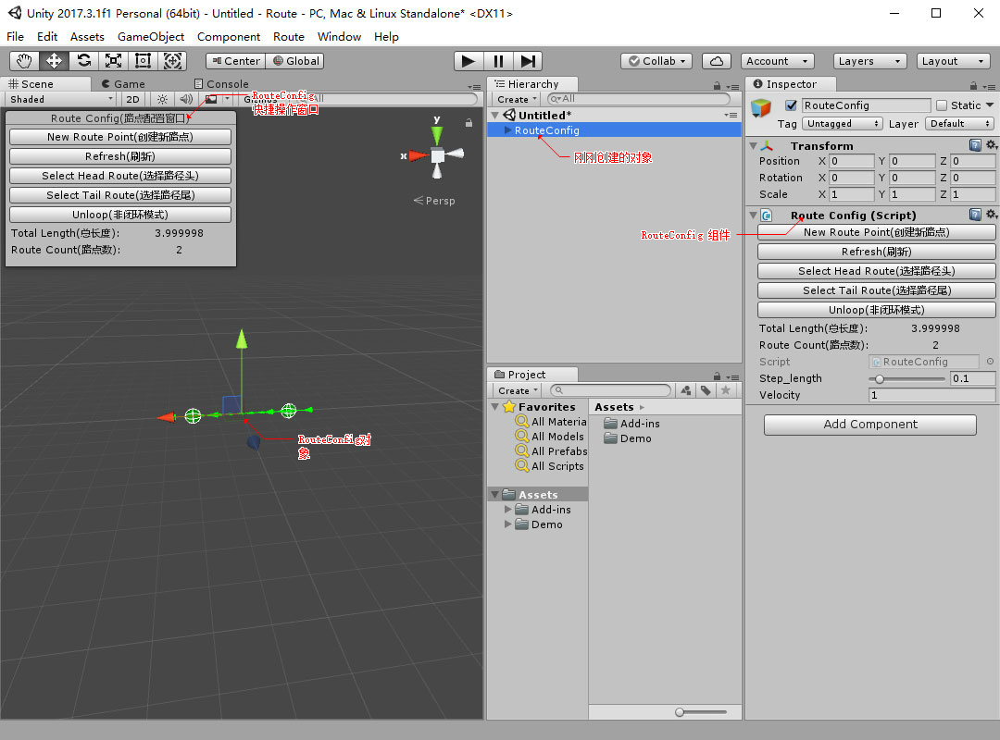
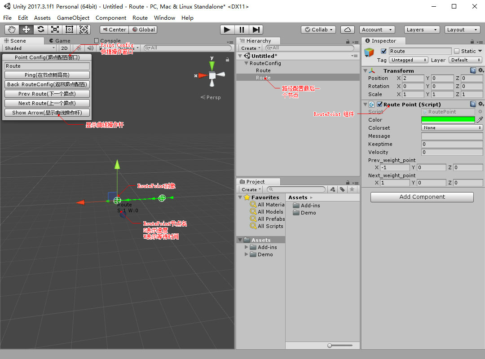
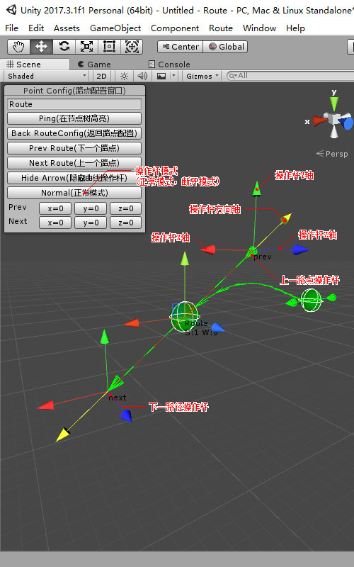
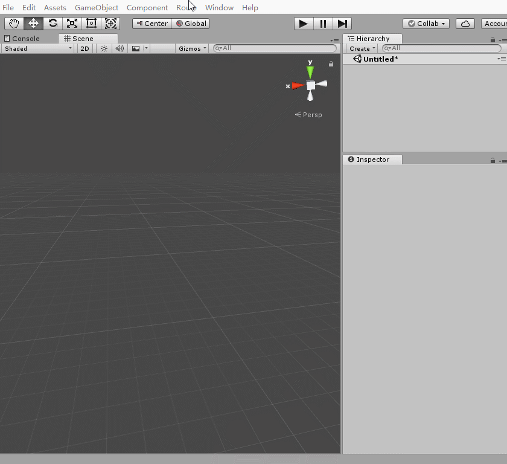
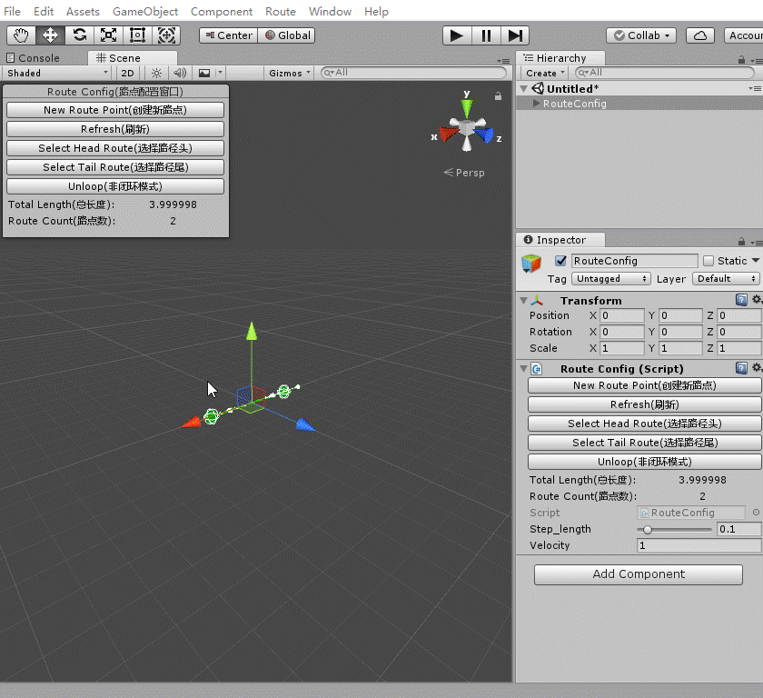
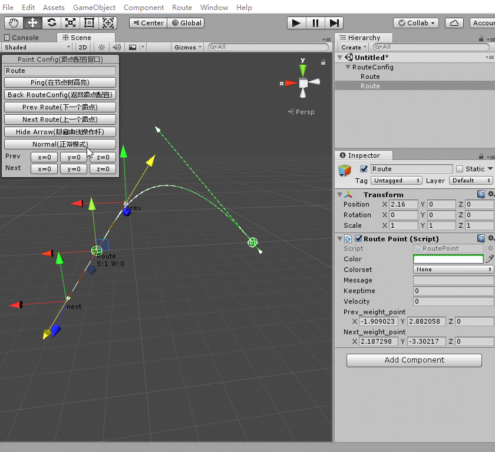

快速开始
=======

1.创建并配置
-----------

选择菜单Route->Create Route Config。  


会创建一个RouteConfig对象，并对准到SceneView中心。


点击“Route Config(路径配置窗口)”上的“Select Tail Route(选择路径尾)”按钮，对选中改路径配置中尾部节点




2.使用路径
----------

定义一个*RouteController*对象，初始化。
```csharp
RouteController controller = new RouteController();
```

向*RouteController*对象设置*RouteConfig*。
```csharp
controller.SetRouteConfig(GetComponent<RouteConfig>());
```

然后在Update函数中，调用
```csharp
controller.Update(Time.deltaTime, obj);
```

以下为一个完整例子

```csharp
public class Demo : MonoBehaviour
{
    void Start()
    {
        config = GetComponent<RouteConfig>();
        controller = new RouteController();
        controller.SetRouteConfig(config);
        obj = GameObject.CreatePrimitive(PrimitiveType.Cube);
    }
    void Update()
    {
        controller.Update(Time.deltaTime, obj);
    }
    RouteConfig config;
    RouteController controller;
    GameObject obj;
}
```

3.动画演示
---------






